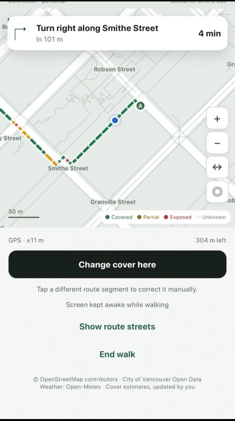
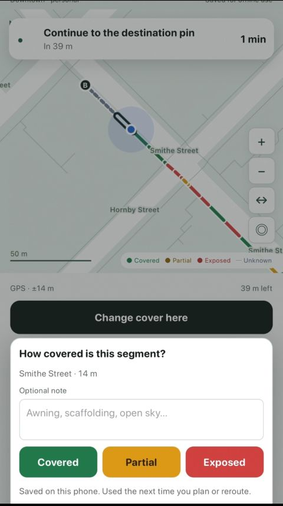

# RainCouver

RainCouver is a phone web app for finding and following drier walks through downtown Vancouver. It compares faster and more sheltered routes, then shows street coverage as you walk.

**Status:** Core routing and walk tracking are implemented. Real-world phone testing is next.

## Walking with RainCouver

  
  

Follow turn-by-turn directions while seeing covered, partially covered, exposed, and unknown street segments on the map. RainCouver tracks your location, shows the next instruction and distance remaining, and can reroute when you go off course.

Coverage can be corrected during a walk. Tap a route segment to mark it covered, partially covered, or exposed, and optionally add a note. Corrections are saved on your device and used for future routes.

## What it does

- Plans downtown Vancouver walking routes, including fastest and drier options with a 30% detour cap.
- Uses an offline map and walking network, with searchable places and intersections.
- Provides live GPS progress, turn guidance, arrival detection, rerouting, and walk resume.
- Includes initial LiDAR-based cover estimates for 4,334 segments; other segments are shown as unknown.
- Saves coverage corrections and notes locally, with backup and restore.
- Uses OpenStreetMap and Vancouver Open Data; weather is provided by Open-Meteo.

## Where it’s headed

The next focus is testing real walks on a phone: checking compass behavior, GPS accuracy, rerouting, and offline use. The project can then improve street and entrance details, add more LiDAR coverage, and consider walk history and correction review. Initial coverage estimates are provisional, and broader LiDAR coverage is an optional data-quality improvement.
